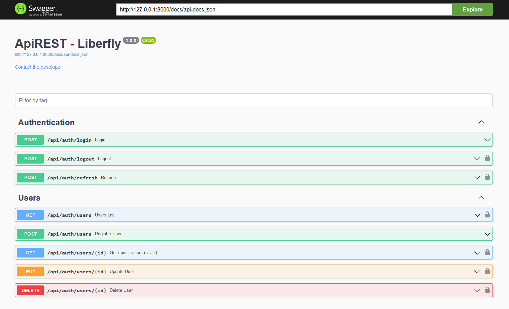
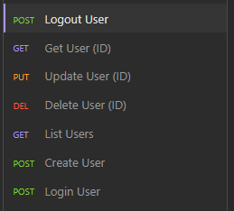
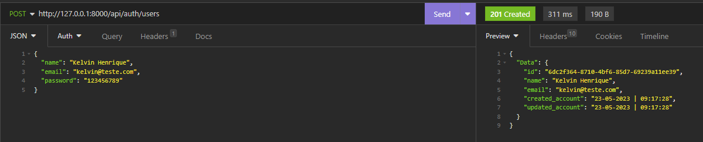
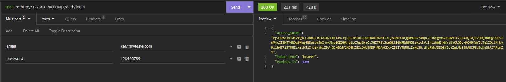
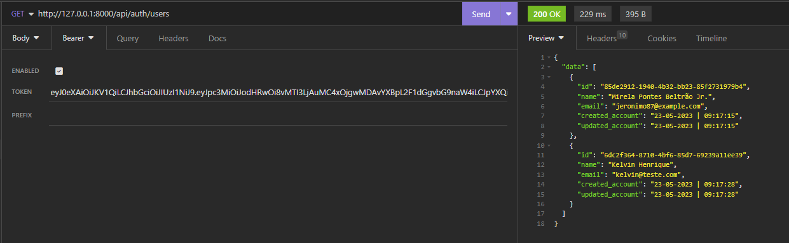

# Api REST - Liberfly

## Getting started

1. Clone the repo

```
git clone https://github.com/kelvinhenri99/APIREST_liberfly.git
```

2. Install Laravel dependencies

```
composer install
```

3. Duplicate the '.env.example' file and place it as .env

```
DB_DATABASE = yourdatabase_name
DB_USERNAME = your_username
DB_PASSWORD = your_password
```

4. Run migration & Seeder

```
php artisan migrate --seed
```

5. Generate your application encryption key using

```
php artisan key:generate
```

6. Generate Swagger API

```
php artisan l5-swagger:generate
```

## Usage

1. Start the server

```
php artisan serve
```

### Use External tools

To access documentation via Swagger:

```
http://127.0.0.1:8000/api/documentation
```


<ht>
Also test with Ansomnia or Postan
<br>


<hr>
1° - Create a new User (EMAIL | NAME | PASSWORD)


<hr>
2° - Login with previously created email and password


With login, it will generate the token that will be necessary to validate the other routes
<hr>
3° - Test another route passing token in validation to access data


